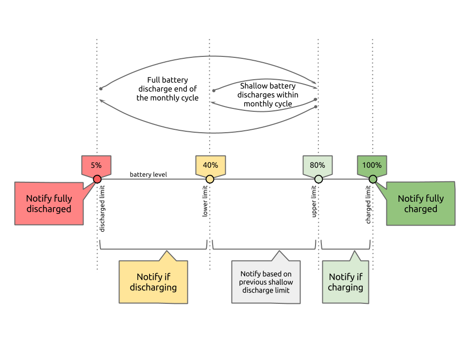

batteryShallowDischarge
=======================

on{X} javascript rule to help with shallow battery discharges.

### What is a shallow battery discharge?
Keep the battery level between 40% and 80%. Do a full discharge once a month. Read more about what shallow battery discharge is and why to do it at this lifehacker article [How Often Should I Charge My Gadget's Battery to Prolong Its Lifespan?](http://lifehacker.com/5875162/how-often-should-i-charge-my-gadgets-battery-to-prolong-its-lifespan)

### What does the script do?

This script prompts you to connect or disconnect charger by doing below things.

1. Notifies when battery level reaches the shallow discharge range limits 40% or 80%. 
2. Notifies when battery level is fully charged or discharged so that you can connect or disconnect your charger. 
3. Notifies you to fully discharge if you're not doing so after a month of shallow discharges. The script keeps track of the monthly cycle so you don't have to. 
4. Notifies you to unplug if you connect charger without the battery reaching 40% (similarly for 80% too). The script prompts you to correctly do shallow discharges. 

##### Battery Shallow Discharge workflow:



### How do the notifications look like?

1. Notification when charging and battery level reaches 80%.

        Unplug.
        Battery: 80%

2. Notification when discharging and battery level reaches 40%.

        Plug in.
        Battery: 40%

3. Notification when device is plugged without doing a full discharge and current battery is at 70%.

        Discharge fully.
        Battery: 70%

### How do I get this on my phone?

You need the on{X} app installed. You can read about it on the [on{X} site](https://www.onx.ms/#!landingPage). As of today, on{X} is available on Android and NOT on iOS and Windows. 

### This stuff is not working. What do I do?
You can set the `debug` variable and look at the script's log on on{X} website. Remember to reset it as logging eats battery. 

```JavaScript
// set true for debug logs
var debug = true;
```

### I want to change the 40% and 80% limits. What do I do?
Change them in the script. Set them in increments of 5. 

```JavaScript
// battery level limts
var lowerLimit = 40; //should be 5x
var upperLimit = 80; //should be 5x
```
